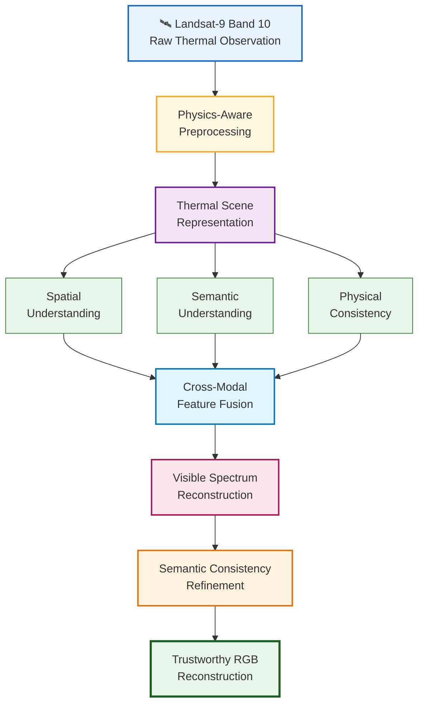
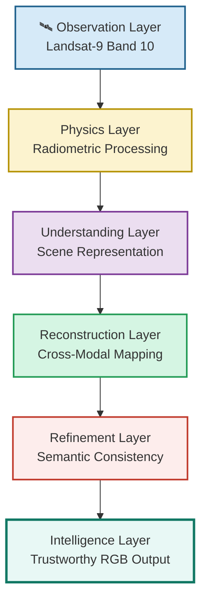

# ISRO BAH 2026 Idea Submission Template Guide
> **Screening Strategy:** This document details the precise text copy and the exact Mermaid visualizations required for each critical slide in the template to pass the automated technical screening round.

---

# Opportunity

## Problem with Existing Approaches

Most existing thermal-to-visible reconstruction methods formulate the problem as a direct image-to-image translation task. While they often generate visually appealing outputs, they rarely consider the physical nature of thermal sensing, resulting in semantic inconsistencies, structural distortions, and reduced reliability for real-world satellite analysis.

---

## Our Opportunity

We view thermal imagery not as a grayscale photograph, but as a scientific measurement of the Earth's emitted energy.

Instead of directly predicting colors, SMART-VIS first preserves the physical information contained within the thermal observations, progressively understands the scene, and finally reconstructs a trustworthy visible-spectrum representation.

---

## How SMART-VIS Solves the Problem

SMART-VIS decomposes the reconstruction process into independent reasoning stages.

• Preserve physically meaningful thermal information.

• Learn robust scene representations.

• Reconstruct visible appearance through hierarchical reasoning.

• Preserve semantic and structural consistency throughout reconstruction.

---

## Unique Selling Proposition (USP)

> **"From Thermal Measurements to Trustworthy Visual Intelligence."**

SMART-VIS is a **Physics-Guided, Reasoning-Driven Framework** that prioritizes **scientific trustworthiness** over purely visual realism, enabling reconstructed RGB imagery that is both visually meaningful and physically defensible.

# Features Offered by SMART-VIS

SMART-VIS is designed as a modular framework where each stage addresses a specific scientific challenge in thermal-to-visible reconstruction. Rather than relying on a single end-to-end translation network, every module contributes towards producing physically meaningful, semantically reliable, and visually interpretable outputs.

---

## Physics-Aware Thermal Processing

Converts raw Landsat Level-1 thermal observations into physically meaningful representations while preserving the original sensor information. This ensures that learning begins from scientific measurements rather than visualization-oriented grayscale images.

---

## Hierarchical Scene Understanding

Instead of directly assigning colors, SMART-VIS progressively learns structural patterns, contextual relationships, and semantic characteristics of the observed scene before attempting visible-spectrum reconstruction.

---

## Cross-Modal Reconstruction

Bridges the gap between thermal and visible domains by learning robust feature representations capable of reconstructing realistic RGB imagery while maintaining consistency with the observed thermal measurements.

---

## Semantic Consistency Preservation

Preserves the identity and spatial relationships of important land-cover classes such as vegetation, water bodies, urban regions, and transportation networks, minimizing physically implausible color assignments.

---

## Modular & Extensible Architecture

Each functional component operates independently, enabling future improvements, replacement of individual modules, or adaptation to different satellite sensors without redesigning the complete framework.

---

## Designed for Downstream Intelligence

The reconstructed imagery is optimized not only for human interpretation but also for improving downstream computer vision tasks such as object detection, segmentation, disaster assessment, and environmental monitoring.

---

### Key Takeaway

> **SMART-VIS does not simply generate colors—it reconstructs trustworthy visual information by combining physics, scene understanding, and semantic reasoning.**

# Process Flow

SMART-VIS reconstructs visible-spectrum imagery through a sequence of interpretable reasoning stages instead of a single end-to-end translation network.

The framework progressively transforms raw thermal observations into trustworthy RGB imagery by preserving physical information, understanding scene context, reconstructing visible appearance, and refining semantic consistency.

### Process Overview

1. Acquire original Landsat-9 Band 10 thermal observations.
2. Preserve radiometric information through physics-aware preprocessing.
3. Learn robust thermal scene representations.
4. Independently analyze spatial structures, semantic context, and physical characteristics.
5. Fuse complementary information across all feature domains.
6. Reconstruct the visible-spectrum image.
7. Refine semantic consistency to preserve object identity and structural integrity.
8. Produce a trustworthy RGB image suitable for both human interpretation and downstream AI tasks.

---

### Key Takeaway

> **SMART-VIS follows the principle: Observe → Understand → Reconstruct → Trust.**

# SMART-VIS System Architecture

SMART-VIS follows a modular Earth Observation pipeline where each stage performs one well-defined responsibility before passing enriched information to the next stage.

Unlike conventional end-to-end image translation networks, the framework separates observation, interpretation, reasoning, reconstruction and validation into independent modules, improving explainability, modularity and future extensibility.

---

## Architecture Overview

### 1. Observation Layer

Receives original Landsat-9 Level-1 thermal observations while preserving the physical characteristics measured by the satellite sensor.

---

### 2. Physics Layer

Transforms raw thermal measurements into physically meaningful representations suitable for learning without destroying radiometric information.

---

### 3. Understanding Layer

Learns structural, contextual and semantic representations describing the observed Earth scene.

---

### 4. Reconstruction Layer

Transforms thermal scene representations into visible-spectrum imagery while preserving spatial structures and semantic relationships.

---

### 5. Refinement Layer

Improves structural consistency, removes reconstruction artifacts and preserves important land-cover boundaries.

---

### 6. Intelligence Layer

Produces trustworthy RGB imagery suitable for

• Human interpretation

• Object Detection

• Semantic Segmentation

• Disaster Assessment

• Environmental Monitoring

---

### Key Takeaway

> SMART-VIS treats thermal reconstruction as an Earth Observation intelligence pipeline rather than a conventional image generation task.

# Technologies Used

SMART-VIS combines geospatial processing, remote sensing, computer vision and deep learning into a unified Earth Observation framework.

| Layer | Technologies |
|--------|--------------|
| Data Acquisition | USGS EarthExplorer, Landsat 9 Collection-2 Level-1 |
| Geospatial Processing | GDAL, Rasterio, GeoTIFF, NumPy |
| Image Processing | OpenCV, Albumentations |
| Deep Learning | PyTorch, TorchVision |
| Computer Vision | Conditional Image Translation Networks, Semantic Representation Learning |
| Model Training | CUDA, PyTorch Lightning |
| Experiment Tracking | Weights & Biases |
| Visualization | Matplotlib |
| Development | Python, Git, GitHub |

---

### Why These Technologies?

Each technology is selected to preserve scientific integrity throughout the pipeline—from raw satellite measurements to trustworthy RGB reconstruction—while ensuring scalability, reproducibility and modular development.

---

### Key Takeaway

> SMART-VIS integrates the complete Earth Observation ecosystem rather than relying on a single deep learning model.

"The goal isn't to create colors. The goal is to restore understanding."