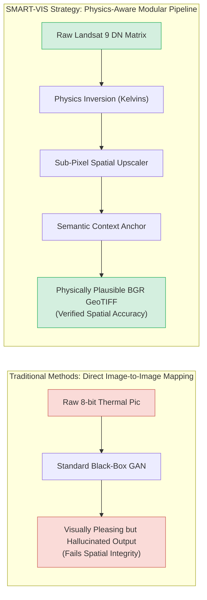
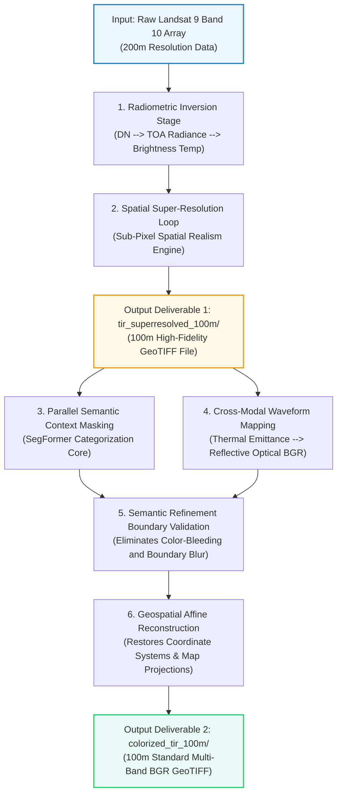
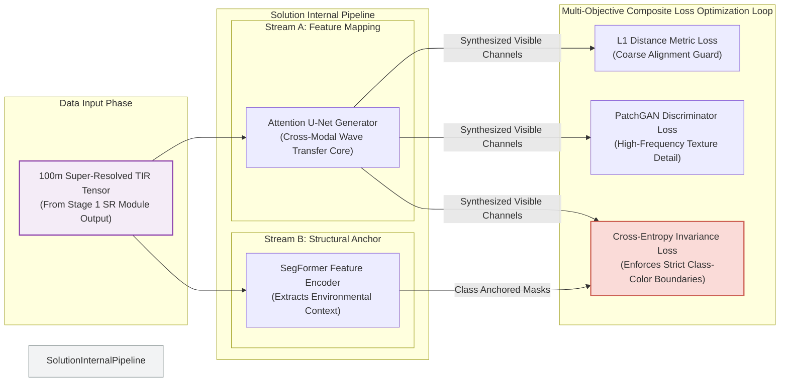

# ISRO BAH 2026 Idea Submission Template Guide
> **Screening Strategy:** This document details the precise text copy and the exact Mermaid visualizations required for each critical slide in the template to pass the automated technical screening round.

---

## SLIDE 3: Opportunity

### Slide Text Content
```text
The Baseline Limitation: Current state-of-the-art approaches treat thermal-to-visible translation as a pure graphic design/image-to-image style transfer problem. They process thermal bands as basic 8-bit pictures, ignoring sensor physics, which causes severe structural blur and hallucinated land objects.
How SMART-VIS Solves It: We break down the challenge into a modular pipeline where data is processed sequentially: Understanding -> Enhancement -> Reconstruction -> Verification.
Unique Selling Proposition (USP): Physics-Aware, Semantically-Guided Modular Inversion. SMART-VIS converts inputs directly into physical Brightness Temperature units (K) and introduces an invariant semantic tracking mask to anchor regional land boundaries. This mathematically prevents the network from hallucinating objects that do not exist.
```

### Slide Visual Component


## SLIDE 4: List of Features Offered

### Slide Text Content
```text
Radiometric Preservation Module: Ingests raw .npy arrays and converts digital counts into real-world Top-of-Atmosphere (TOA) Spectral Radiance and Brightness Temperature (K), maintaining absolute sensor physics.
Multi-Scale Spatial Upscaler: Handles the explicit 200m -> 100m resolution scaling requirement using sub-pixel degradation backpropagation rather than generic bicubic resizing.
Parallel Semantic-Guidance Loop: Uses an internal deep feature extractor to cluster terrain signatures (Water, Veg, Urban, Soil) natively in the latent space to guide color assignments.
Cross-Modal Alignment Engine: Synthesizes the reflective characteristics of optical bands from emissive signatures.
GeoTIFF Compliance Formatter: Automatically structures outputs into the mandated output/model_outputs/ directories using strict Blue-Green-Red (BGR) channel sequencing.
```

## SLIDE 5: Process Flow Diagram / Use-Case Diagram

### Slide Visual Component


## SLIDE 6: Implementation Methodology (Wireframes/Mocks)

### Slide Text Content
```text
Data Leakage Prevention Protocol: Scene-level spatial separation split (70% Train / 15% Val / 15% Test) to ensure zero patch-level spatial memorization during evaluation.
Patch Matrix Pipeline: Extracts overlapping 256 x 256 arrays from absolute physical units instead of compressed 8-bit images to maintain extreme radiometric bit-depth.
Verification Map Generation: Programmatic output of uncertainty verification maps alongside final BGR layers to flag unconfident pixel regions during downstream human analyst interpretation.
```

## SLIDE 7: Architecture Diagram of the Proposed Solution

### Slide Visual Component


## SLIDE 8: Technologies to be Used

### Slide Text Content
```text
Geospatial Processing Ecosystem: GDAL, Rasterio, Fiona (Ensures target GeoTIFF files preserve geospatial metadata matrices, map projection tags, and coordinate grids perfectly).

Deep Learning Framework: PyTorch, PyTorch Lightning (Powers training loops, handles parallel tensor computations, and standardizes multi-GPU execution pipelines).

Matrix & Image Engineering: NumPy (Enables processing directly on raw radiometric values inside .npy training patches), OpenCV, Albumentations (Provides robust, geospatial-safe data augmentation arrays).

Pre-trained Backbones & Tracking: HuggingFace Transformers (Accessing pre-trained remote sensing encoders), Weights & Biases (W&B) (Monitors ablation metrics and loss convergence stability).
```