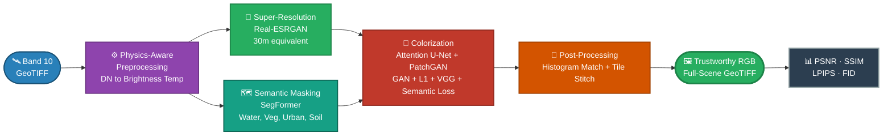
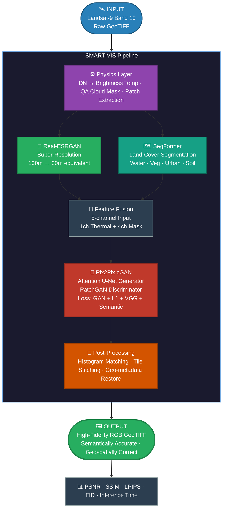

# SMART-VIS — PPT-Ready Mermaid Diagrams
> Paste at **https://mermaid.live** → Export PNG (1920x1080) → Insert into slide

---

## SLIDE 5 — Process Flow Diagram
> Clean left-to-right, fits perfectly on one landscape slide

```mermaid
flowchart LR
    A(["🛰️ Landsat-9\nBand 10\nGeoTIFF"])

    subgraph PRE["⚙️ Preprocessing"]
        B["DN to\nBrightness Temp\nCloud Masking"]
    end

    subgraph ENH["🔬 Enhancement"]
        C["Super-Resolution\nReal-ESRGAN"]
    end

    subgraph SEM["🗺️ Semantic Guidance"]
        D["Land-Cover Masking\nSegFormer"]
    end

    subgraph COL["🎨 Colorization"]
        E["Attention U-Net\nPix2Pix cGAN"]
    end

    subgraph REF["🧹 Refinement"]
        F["Histogram Match\nTile Stitching"]
    end

    G(["🖼️ RGB\nGeoTIFF\nOutput"])

    A --> PRE --> ENH --> SEM --> COL --> REF --> G

    style PRE fill:#1a3a5c,color:#fff,stroke:#4a90d9,stroke-width:2px
    style ENH fill:#1a4731,color:#fff,stroke:#27ae60,stroke-width:2px
    style SEM fill:#3d1a5c,color:#fff,stroke:#8e44ad,stroke-width:2px
    style COL fill:#5c1a1a,color:#fff,stroke:#e74c3c,stroke-width:2px
    style REF fill:#5c4200,color:#fff,stroke:#e67e22,stroke-width:2px
    style A fill:#2c3e50,color:#fff,stroke:#95a5a6,stroke-width:2px
    style G fill:#1a4731,color:#fff,stroke:#27ae60,stroke-width:3px
```

---

## SLIDE 5 (Alt) — Process Flow with Parallel Branch
> Shows SR + Semantic happening in parallel — slightly more technical

---

## SLIDE 7 — Architecture Diagram
> Top-down system architecture, fits a full slide cleanly

---

## Export Tips for PPT
1. Go to https://mermaid.live
2. Paste the diagram code → it renders on the right
3. Click **"Export"** → choose **PNG** → set width to **1920px**
4. Insert the PNG image into your PPT slide
5. Set slide background to **dark (#0d1117)** for best contrast with the colored nodes
