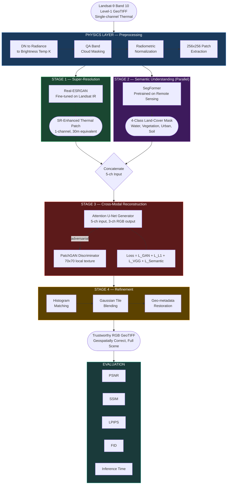
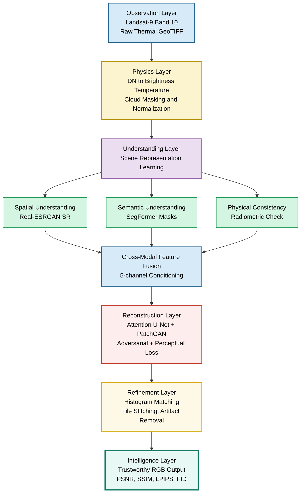
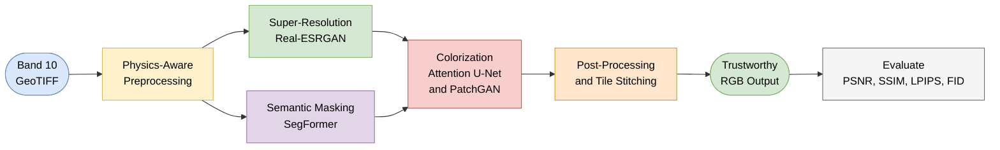
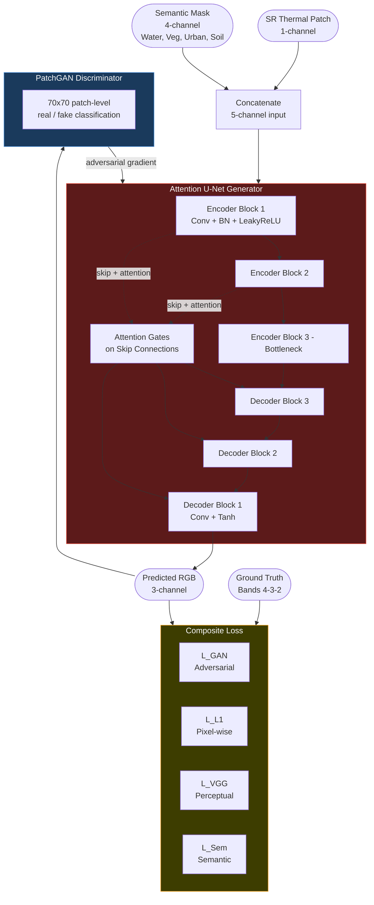

# SMART-VIS — Mermaid Diagrams for Idea Submission
> Paste any diagram at: https://mermaid.live

---

## Diagram 1 — Full Pipeline Architecture
> Use for: Slide 5 (Process Flow) or Slide 7 (Architecture)

---

## Diagram 2 — SMART-VIS Reasoning Layers
> Use for: Slide 5 (Process Flow)

---

## Diagram 3 — Simple Process Flow
> Use for: Slide 5 (if space is tight, most readable)

---

## Diagram 4 — Colorization Model Detail
> Use for: Slide 7 (Architecture deep-dive)

